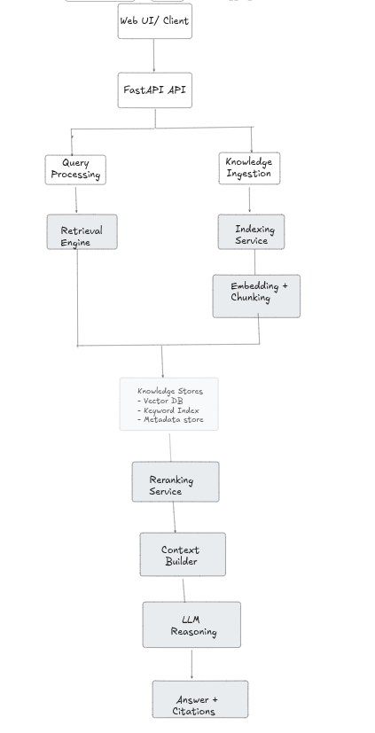
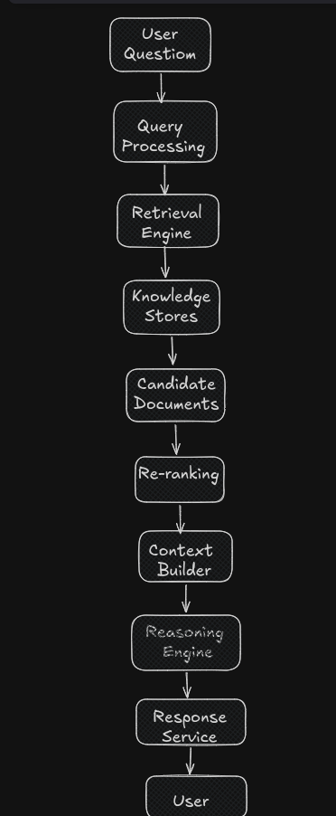

# System Architecture

## 1. Vision

Project Helix is an enterprise-grade Engineering Knowledge Platform designed to solve enterprise knowledge fragmentation. By combining fragmented data streams (from GitLab repo, Jira ticket, Confluence docs, design docs, API docs, standup meets MoM etc.) Helix creates a central, queryable intelligence layer for the developers.

Instead of delivering endless lists of static search results or relying on AI text completion, Helix employs a multi-stage hybrid retrieval and reasoning pipeline to generate precise, citation-backed answers grounded in real-time enterprise context.

## 2. Problem Statement

Modern dev teams suffer from severe knowledge fragmentation. This fragmentation creates several challenges, include, but are not limited to the following:

- **Wasted Engineering Time:** Developers search 4–5 different tools to answer a single technical question.

- **Duplicated Effort:** Teams re-implement existing solutions because past work isn't discoverable.

- **Slow Onboarding:** New hires rely heavily on tribal knowledge and busy senior developers.

- **Lost Context:** When any senior engineer leaves the company, takes away any unwritten context with them.

## 3. Why Existing Solutions Fall Short

Current enterprise search relies on simple keyword matching, forcing developers to dig through endless documents manually. Basic AI assistants try to fix this, but their simplistic search pipelines fail to connect dots across multiple tools or preserve critical context.

Project Helix solves this by combining scattered data through intelligent ingestion, multi-stage hybrid retrieval, cross-encoder reranking, and citation-backed answer generation.

## 4. Goals

- **Multi-Source Hybrid Search:** Combine lexical and vector search with cross-encoder reranking.
- **Event-Driven ETL:** Process incoming webhooks asynchronously.
- **Citation-Backed Generation:** Every response claim maps directly to verifiable source links.
- **Fine-Grained Security:** Enforce user role-based access control (RBAC) at the retrieval layer.

## 5. Non-Goals

- **Generic AI Chatbot:** Not a general-purpose conversational virtual assistant.
- **Automated Code Execution:** Will not execute scripts or auto-merge code into repos.
- **Model Pre-training:** Uses existing foundation models via strict RAG pipelines rather than training from scratch.

## 6. High-Level Architecture

At a high level, the system consists of the following components:

### A. Ingestion Phase

- **Knowledge Ingestion Service:** Collects documents from supported enterprise knowledge sources and extracts metadata (useful for RBAC, timestamp based queries etc.)
- **Indexing Service:** Performs document chunking, generates vector embeddings, and builds searchable indexes.
- **Knowledge Stores:** Stores both dense vector representations and keyword indexes to enable hybrid retrieval.

### B. Query Phase

- **Query Processing Service:** Analyzes user queries, rewrites ambiguous requests and determines an optimal retrieval strategy.
- **Retrieval Engine:** Retrieves candidate documents using combination of metadata filtering, semantic and keyword searches.
- **Reranking Service:** Reorders retrieved documents based on semantic relevance before passing them to the language model.
- **Context Builder:** Selects and compresses the highest-quality evidence into an optimized prompt.
- **Reasoning Engine (LLM):** Generates a grounded response using only the retrieved context.
- **Response Service:** Streams the generated answer back to the client together with supporting citations and metadata.

**Note:** For a visual breakdown of the end-to-end data flow and component relationships, please refer to the architecture flowchart:

## 7. System Components

### 7.1 Knowledge Ingestion Service

- **Purpose:** Collects raw data and normalizes it.
- **Responsibilities:** Reading documents, parsing document formats, metadata extraction.
- **Input:** Source repositories, docs platforms, local files etc.
- **Output:** Normalized documents, extracted metadata.
- **Dependencies:** Data connectors, file parsers.

### 7.2 Indexing Service

- **Purpose:** Prepares normalized data for search.
- **Responsibilities:** Document chunking, vector embeddings generation, lexical indexing.
- **Input:** Normalized documents, metadata.
- **Output:** Document chunks, embeddings, inverted indexes.
- **Dependencies:** Embedding models.

### 7.3 Knowledge Stores

- **Purpose:** Stores indexed knowledge and provides efficient retrieval mechanisms for semantic, lexical & metadata searches.
- **Responsibilities:** Vector database storage, metadata management, search index hosting.
- **Input:** Embedded chunks, metadata.
- **Output:** Direct search targets, stored records.
- **Dependencies:** Vector DB, Relational DB, Search Engine.

### 7.4 Query Processing Service

- **Purpose:** Refines and interprets user input.
- **Responsibilities:** Query analysis, query rewriting/expansion, intent detection.
- **Input:** Raw user query, conversation state.
- **Output:** Structured search parameters, filter tags.
- **Dependencies:** Query analysis models, rule-based processors or LLM.

### 7.5 Retrieval Engine

- **Purpose:** Fetches candidate chunks from stores.
- **Responsibilities:** Hybrid retrieval, metadata filtering, initial candidate selection.
- **Input:** Search parameters, filters.
- **Output:** Unranked candidate chunks.
- **Dependencies:** Knowledge Stores.

### 7.6 Reranking Service

- **Purpose:** Sharpens retrieval accuracy.
- **Responsibilities:** Improving retrieval quality, re-scoring candidates, ordering candidates.
- **Input:** Raw query, unranked candidate chunks.
- **Output:** Top-K ranked chunks.
- **Dependencies:** Cross-encoder model.

### 7.7 Context Builder

- **Purpose:** Prepares the final prompt payload.
- **Responsibilities:** Removing duplicates, compressing context, prompt construction.
- **Input:** Top-K ranked chunks, query history.
- **Output:** Token-budgeted prompt context.
- **Dependencies:** Tokenizers, prompt templates.

### 7.8 Reasoning Engine

- **Purpose:** Generates answers using the LLM.
- **Responsibilities:** Calling the LLM, grounded answer generation, enforcing context rules.
- **Input:** Formatted prompt context.
- **Output:** Generated text stream, citations.
- **Dependencies:** Configurable Language Model Interface.

### 7.9 Response Service

- **Purpose:** Delivers output to the end user.
- **Responsibilities:** Streaming answers, returning citations, confidence metadata attachment.
- **Input:** Text stream, citation maps.
- **Output:** User-facing response payload.
- **Dependencies:** API Gateway / Web layer.

## 8. Data Flow & Sequence

To understand how processing of user queries hapeens end-to-end, refer to the high-level data flow diagram:

## 9. Security Considerations

1). Role Based Access Control (RBAC)  
2). Prompt Injection Defense  
3). PII Redaction & Sanitization  
4). Output Guardrails
